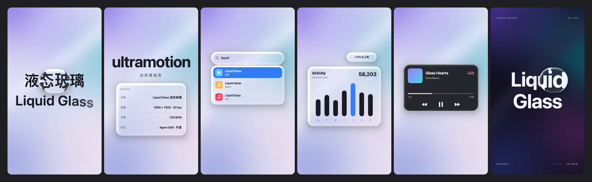

# ultramotion

Motion templates for AI agents. Each style is an [Agent Skill](https://agentskills.io): install it, and your agent can turn one prompt into a finished video with music.

[](https://sunsiyuan.github.io/ultramotion/)

## Install

```sh
npx skills add sunsiyuan/ultramotion
```

Or copy a style folder into your agent's skills directory, e.g. `skills/liquid-glass` → `~/.claude/skills/` (Claude Code) or `~/.codex/skills/` (ChatGPT Codex).

## Styles

| Style | | |
|---|---|---|
| [Liquid Glass](skills/liquid-glass) | Apple-style glass that pops, stretches, merges and bends text | 9:16, 120 BPM |

## Requirements

A headless Chromium-based browser with WebGL, ffmpeg, and Python with numpy and scipy for the soundtrack.

## Benchmark

Same prompt, without and with the skill, on Claude Code (Sonnet 5.5) and ChatGPT Codex (GPT-6.1-Sol): [see the videos](https://sunsiyuan.github.io/ultramotion/#benchmark).

## License

MIT. The website font in `assets/fonts` is under the SIL Open Font License.
